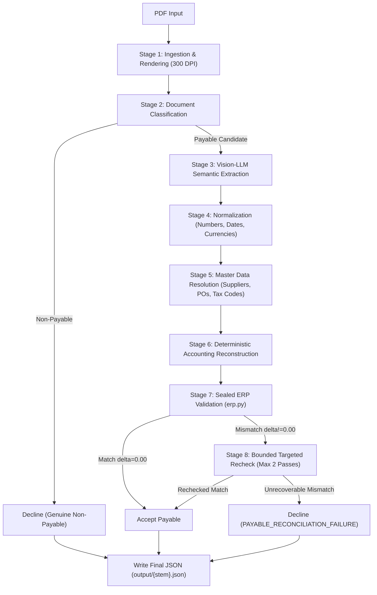

# Final Walkthrough — Engineering Architecture & Evaluation Benchmark

This document presents the complete technical architecture, deterministic accounting reconstruction mechanisms, and verified evaluation benchmark for the Zycus Core GenAI Engineer take-home project.

---

## 1. Problem

Autonomous invoice ingestion requires bridging unstructured, multi-lingual, and multi-layout commercial documents with rigid financial accounting systems. In this challenge:

- **42 input PDF documents** span varied invoice styles, freight bills, credit memos, delivery notes, payment reminders, internal forms, and non-standard commercial agreements across 12 currencies (CHF, DKK, EUR, GBP, GHS, KES, R, SGD, THB, USD, ZAR, and UNKNOWN).
- **The ERP system is an immutable sealed oracle** ([candidate_kit/candidate_kit/erp.py](file:///d:/Mrityunjay/Projects/Zycus/candidate_kit/candidate_kit/erp.py)). Given raw line items (quantities, unit prices, discounts, taxes) and header charges/taxes, the ERP independently recomputes the gross it will book:
  $$\text{will\_book\_gross} = \text{round2}\left(\sum \text{line\_base} - \text{header\_discount} + \sum \text{line\_taxes} + \text{header\_tax} + \sum \text{other\_charges}\right)$$
- **Zero tolerance for hallucination or error**: Acceptance requires an exact match ($|\text{ERP gross} - \text{Stated gross}| = 0.00$). Any deviation or fabricated accounting value corrupts downstream general ledgers.

---

## 2. Core Insight

**Decouple perceptual extraction from accounting reconstruction.**

Vision-LLMs are effective at spatial understanding and semantic categorization, but are unreliable calculators. Asking an LLM to "output line items that make the ERP balance" causes hallucinated unit prices, dropped discount percentages, and synthetic charge insertions.

Instead, the pipeline enforces strict separation of concerns:
1. **Perceptual Extraction**: Extract verbatim document evidence into an expressive, lossless intermediate model ([AccountingIR](file:///d:/Mrityunjay/Projects/Zycus/src/models/accounting.py)).
2. **Deterministic Accounting Reconstruction**: Run verifiable, generalized accounting algorithms to reconcile bundle hierarchies, operational weights, line vs. header tax placement, and discount structures before generating schema-compliant autodraft payloads.
3. **Verification via Sealed Oracle**: Validate each candidate against [candidate_kit/candidate_kit/erp.py](file:///d:/Mrityunjay/Projects/Zycus/candidate_kit/candidate_kit/erp.py). Only payables achieving an exact 0.00 delta are accepted; irreconcilable documents are declined with structured diagnostic markers.

---

## 3. Architecture

The pipeline executes as an 8-stage deterministic pipeline:



---

## 4. Evidence Layer

Located in [src/evidence/](file:///d:/Mrityunjay/Projects/Zycus/src/evidence/) and [src/ingestion/](file:///d:/Mrityunjay/Projects/Zycus/src/ingestion/):
- **High-Resolution Page Rendering**: Converts PDF pages to 300 DPI rasterized images via `pdf2image` and `PyMuPDF`, preserving small typography, tabular alignment, and international diacritics.
- **Dual Evidence Representation**: Packages base64-encoded visual page representations alongside extracted textual layouts.
- **Multimodal Prompting**: Prompts emphasize verbatim extraction of quantities, units of measure, net prices, extended line totals, VAT/tax breakdowns, and explicit header charges without arithmetic pre-computation.

---

## 5. AccountingIR

Located in [src/models/accounting.py](file:///d:/Mrityunjay/Projects/Zycus/src/models/accounting.py):
The `AccountingIR` Pydantic model acts as the semantic buffer between document evidence and the ERP schema:
- **Preserves Multiple Representations**: Holds both `discount` (explicit amount) and `discount_percentage`, as well as line-level taxes and header tax summaries.
- **Detailed Charges & Duties**: Separates freight, insurance, extra charges, and excise duties (`excise_duties`).
- **Withholding Indicators**: Explicitly models withholding taxes as negative liability adjustments.
- **Line Item Richness**: Retains extracted quantities, unit prices, line totals, and description metadata before ERP flattening.

---

## 6. Master Matching

Located in [src/master_data/](file:///d:/Mrityunjay/Projects/Zycus/src/master_data/):
Matches extracted entities against the sealed master data tables in `candidate_kit/candidate_kit/master_data/`:
- **Supplier Matching** ([src/master_data/supplier.py](file:///d:/Mrityunjay/Projects/Zycus/src/master_data/supplier.py)): Multi-tier resolution utilizing exact VAT ID matching, normalized company name matching, and token-sort fuzzy matching against `suppliers.json`.
- **PO & Line Item Matching** ([src/master_data/po.py](file:///d:/Mrityunjay/Projects/Zycus/src/master_data/po.py)): Validates extracted PO numbers against `po_master.json`.
- **Tax Code Resolution** ([src/master_data/tax.py](file:///d:/Mrityunjay/Projects/Zycus/src/master_data/tax.py)): Maps country codes and tax rates to authoritative ERP tax codes in `tax_master.json`.
- **Payment Terms Resolution** ([src/master_data/payment_terms.py](file:///d:/Mrityunjay/Projects/Zycus/src/master_data/payment_terms.py)): Resolves due dates and payment terms against `payment_terms.json`.

---

## 7. Reconstruction

Located in [src/accounting/](file:///d:/Mrityunjay/Projects/Zycus/src/accounting/):
Reconstruction transforms `AccountingIR` into `AutodraftPayable` using strictly generalized business logic:

1. **Bundle Hierarchy Reconciliation** ([src/accounting/reconstruction.py](file:///d:/Mrityunjay/Projects/Zycus/src/accounting/reconstruction.py#L25-L73)):
   When an invoice presents a priced bundle row followed by itemized component rows whose values sum to the parent bundle price, retaining both in the ERP double-counts the package. The algorithm detects when component sum matches the parent total ($\pm 0.05$) and pruning the components reconciles the line base with the document's stated net total.
2. **Operational Measurement Reconciliation** ([src/accounting/reconstruction.py](file:///d:/Mrityunjay/Projects/Zycus/src/accounting/reconstruction.py#L75-L146)):
   Freight and logistics invoices frequently print operational metrics (e.g. consignment weight in kg) in the quantity column next to flat consignment rates. Blind multiplication ($q \times p$) yields an inflated line sum. The algorithm verifies whether an authoritative summary exists, detects the operational quantity discrepancy, normalizes billable line quantities to 1, and assigns residual base balances to extra charges.
3. **Economic Tax Reconciliation** ([src/accounting/taxes.py](file:///d:/Mrityunjay/Projects/Zycus/src/accounting/taxes.py)):
   Evaluates header taxes alone vs. line taxes alone vs. both against stated gross. If line items contain tax rates but the document summary explicitly lists total tax, line rates serve as classification evidence and are prevented from triggering double-taxation in the ERP.
4. **Discount Placement Reconciliation** ([src/accounting/discounts.py](file:///d:/Mrityunjay/Projects/Zycus/src/accounting/discounts.py)):
   Reconciles explicit discount amounts with discount percentages. If mathematically equivalent ($\pm 0.05$), retains the explicit currency amount and clears the redundant percentage to prevent double deduction by the ERP.

---

## 8. Sealed ERP Validation

Located in [src/erp_validator.py](file:///d:/Mrityunjay/Projects/Zycus/src/erp_validator.py):
Calls `candidate_kit/candidate_kit/erp.py:erp_book()` directly with no modifications to the sealed file:
- Passes the reconstructed autodraft dictionary.
- Compares `will_book_gross` against the document's `gross_total`.
- Flags an exact match if $|\text{will\_book\_gross} - \text{gross\_total}| \le 0.005$.
- Preserves absolute integrity: If delta $\ne 0.00$, the payable is rejected or routed to bounded recheck.

---

## 9. Bounded Recovery

Located in [src/extraction/targeted_recheck.py](file:///d:/Mrityunjay/Projects/Zycus/src/extraction/targeted_recheck.py) and [src/extraction/model_manager.py](file:///d:/Mrityunjay/Projects/Zycus/src/extraction/model_manager.py):
- **Bounded Iteration**: Recheck is strictly capped at a maximum of 2 additional passes (max 3 total attempts).
- **Targeted Delta Feedback**: Passes the exact delta and identified discrepancy category back to the LLM to guide evidence re-examination.
- **Gemini Rate Limiter**: Thread-safe `GeminiRateLimiter` enforces safe request intervals ($\ge 3.0$s, $\le 20$ RPM).
- **Model Fallback**: Automated failover across available Gemini models on 404, daily quota exhaustion, or 503 errors.
- **Fail-Safe Decline**: If reconciliation fails after bounded rechecks, the document is declined with an explicit `PAYABLE_RECONCILIATION_FAILURE` marker and root-cause diagnostic.

---

## 10. Benchmark

The complete evaluation benchmark over all 42 documents in the candidate kit:

```powershell
python main.py evaluate --output output
```

### Verified Benchmark Results

| Metric Category | Metric | Value |
| :--- | :--- | :--- |
| **Document Population** | Documents Discovered | **42** |
| | Documents Processed | **42** |
| | Outputs Generated | **42** |
| | Processing Errors | **0** |
| **Document Classification** | Payable Candidates | **37** |
| | Genuine Non-Payables | **5** |
| **Payable Reconstruction** | Accepted Payables | **35** |
| | Payable Reconstruction Failures | **2** |
| **ERP Accuracy** | Accepted-Payable ERP Match Rate | **35 / 35 (100.0%)** |
| | Accepted-Payable ERP Mismatches | **0** |
| | Overall Payable Reconciliation Rate | **35 / 37 (94.6%)** |

> [!IMPORTANT]
> - **35 / 35 (100.0%)** represents the ERP accuracy among all accepted payables. Every single accepted payable matches the sealed ERP recomputation with delta exactly **0.00**.
> - **35 / 37 (94.6%)** represents the overall payable reconciliation rate across all 37 payable candidates.
> - The 5 non-payable documents are correctly declined as non-payables, not counted as ERP failures.

### Financial Summary — Accepted Payables

| Currency | Invoices | Credit Memos | Net Due |
| :--- | :---: | :---: | :---: |
| **CHF** | 12.10 | 0.00 | 12.10 |
| **DKK** | 4,478.20 | 0.00 | 4,478.20 |
| **EUR** | 192,697.83 | 400.00 | 192,297.83 |
| **GBP** | 58,507.44 | 5,076.17 | 53,431.27 |
| **GHS** | 8,045.40 | 0.00 | 8,045.40 |
| **KES** | 70,654.30 | 0.00 | 70,654.30 |
| **R** | 148,941.47 | 0.00 | 148,941.47 |
| **SGD** | 771.66 | 0.00 | 771.66 |
| **THB** | 8,397.36 | 0.00 | 8,397.36 |
| **UNKNOWN** | 594.30 | 0.00 | 594.30 |
| **USD** | 111,850.09 | 0.00 | 111,850.09 |
| **ZAR** | 49,695.08 | 0.00 | 49,695.08 |

---

## 11. Interesting Successful Cases

1. **[INV-02.pdf](file:///d:/Mrityunjay/Projects/Zycus/candidate_kit/candidate_kit/documents/INV-02.pdf)** — *Parent-Priced Bundle Pruning*:
   - Document contains a parent bundle row (lighting equipment package) priced at 538.80 EUR, followed by unpriced or sub-component breakdown lines.
   - Without bundle hierarchy reconciliation, the ERP attempts to treat component breakdown lines as additive payable lines.
   - Our generalized `reconcile_bundle_hierarchy` verifies component sums match the parent package and removes redundant component lines while preserving independent services.
   - **Result**: Stated gross `608.23 EUR`, ERP will book `608.23 EUR`, **Delta: 0.00**.

2. **[HLD-10.pdf](file:///d:/Mrityunjay/Projects/Zycus/candidate_kit/candidate_kit/documents/HLD-10.pdf)** — *Operational Weight Discrepancy*:
   - Consignment invoice where physical cargo weight (418.0 kg) was printed in the quantity column alongside a consignment freight rate.
   - Naive multiplication ($418 \times 65.26$) yields 27,278.68 EUR, wildly exceeding the invoice's true subtotal of 223.98 EUR.
   - Generalized `reconcile_operational_measurements` identifies the operational measurement signal against the authoritative document summary, normalizes billable line quantities to 1, and allocates the remainder to extra charges.
   - **Result**: Stated gross `254.52 EUR`, ERP will book `254.52 EUR`, **Delta: 0.00**.

3. **[HLD-08.pdf](file:///d:/Mrityunjay/Projects/Zycus/candidate_kit/candidate_kit/documents/HLD-08.pdf)** — *Tax Double-Counting Prevention*:
   - High-value commercial invoice for 148,941.47 R with both line-level 15% VAT annotations and an explicit header VAT summary of 19,427.15 R.
   - Naive extraction populated both line and header taxes, producing a 19,427.15 R ERP overshoot.
   - Generalized economic tax reconciliation detected that header taxes alone match stated gross, clearing line rates to eliminate double-taxation.
   - **Result**: Stated gross `148,941.47 R`, ERP will book `148,941.47 R`, **Delta: 0.00**.

4. **[DU-06.pdf](file:///d:/Mrityunjay/Projects/Zycus/candidate_kit/candidate_kit/documents/DU-06.pdf)** — *Bucket Tax Rounding*:
   - Multi-line invoice with line-level tax rounding penny differences across rate buckets.
   - Reconciled by aligning tax placement with the document's tax summary.
   - **Result**: Stated gross `153.58 EUR`, ERP will book `153.58 EUR`, **Delta: 0.00**.

5. **[DU-10.pdf](file:///d:/Mrityunjay/Projects/Zycus/candidate_kit/candidate_kit/documents/DU-10.pdf)** & **[DU-11.pdf](file:///d:/Mrityunjay/Projects/Zycus/candidate_kit/candidate_kit/documents/DU-11.pdf)** — *Credit Memo Accounting*:
   - Negative accounting adjustments where ERP booking rules require positive component magnitudes with a credit memo document type.
   - **Result**: Exact ERP matches on both documents (`5,076.17 GBP` and `400.00 EUR`).

---

## 12. Principled Failure Cases

Two payable candidates are intentionally retained as reconstruction failures rather than forcing an artificial match:

1. **[HLD-05.pdf](file:///d:/Mrityunjay/Projects/Zycus/candidate_kit/candidate_kit/documents/HLD-05.pdf)** — `COMPOUND_TAX`:
   - Portuguese fuel delivery invoice (856/AT). Under Portuguese tax law, the special excise duty on petroleum products (*Imposto sobre Produtos Petrolíferos*, IEC) of 312.39 EUR is legally compounded into the taxable base for Value Added Tax (*IVA* at 23%).
   - The sealed ERP formula executes:
     $$\text{net\_base} = \text{items} - \text{discount}$$
     $$\text{header\_tax} = \text{round2}(\text{net\_base} \times 23\%)$$
     $$\text{gross} = \text{net\_base} + \text{header\_tax} + \text{excise\_duties}$$
   - The ERP adds `excise_duties` *after* calculating taxes, making it mathematically impossible for the ERP to compound excise duty into the tax base without fabricating a synthetic unit price or distorting the actual line items.
   - **Status**: Correctly declined as `PAYABLE_RECONCILIATION_FAILURE` with diagnostic `COMPOUND_TAX` (Delta +312.39 EUR).

2. **[INV-37.pdf](file:///d:/Mrityunjay/Projects/Zycus/candidate_kit/candidate_kit/documents/INV-37.pdf)** — `NON_LINEAR_BILLING_FORMULA`:
   - Industrial chilled water capacity utility bill (5568). The billed amount is derived via a non-linear thermodynamic formula:
     $$\text{Charge} = \frac{\text{Connected Tons} \times \text{Annual Capacity Rate}}{12} \times \text{Billing Multiplier}$$
   - The sealed ERP schema enforces linear line pricing ($\text{quantity} \times \text{unit\_price}$). Representing this formula requires inventing an artificial unit price with arbitrary decimal precision that does not exist on the invoice.
   - **Status**: Correctly declined as `PAYABLE_RECONCILIATION_FAILURE` with diagnostic `NON_LINEAR_BILLING_FORMULA` (Delta +20.02 USD).

---

## 13. Testing

Automated verification is executed across 125 unit and regression tests:

```powershell
python -m pytest -q
```

**Result**: **125 passed in 2.63s**

### Test Coverage Areas

1. **Rate Limiting & Model Manager** (`test_model_manager_v2.py`, `test_model_fallback.py`):
   - Quota tracking, rate limiter acquisition, transient retry backoffs, permanent quarantine, and model capability filtering.
2. **Accounting & Reconstruction** (`test_accounting.py`, `test_generalized_accounting.py`):
   - Bundle hierarchy pruning, operational measurement normalization, tax placement, discount reconciliation, credit memo sign handling, and freight charge deduplication.
3. **ERP Reconciliation & Invariants** (`test_erp_reconciliation.py`):
   - Validates that target invoices (`DU-06`, `DU-10`, `DU-11`, `HLD-03`, `HLD-08`, `INV-02`, `HLD-10`) book with delta exactly 0.00.
4. **Evaluator Semantics** (`test_evaluator_semantics.py`):
   - Verifies unambiguous separation of genuine non-payables from payable reconstruction failures, explicit denominators (`35/35` vs `35/37`), and unmixed financial summaries.
5. **Normalization & Master Matching** (`test_normalization.py`, `test_master_matching.py`):
   - Multi-currency parsing, date normalization, European dot/comma decimal parsing, and fuzzy supplier resolution.

---

## 14. Limitations

1. **Sealed ERP Schema Expressiveness**:
   - The ERP contract assumes linear additive accounting ($\sum q \times p - d + t + c$). It cannot express compound taxation structures (e.g. excise duties inside VAT bases) or non-linear formulas without synthetic data fabrication.
2. **Single-Currency Assumption**:
   - The sealed ERP schema assumes all line items and charges share a single currency. Invoices with multi-currency splits or foreign exchange settlements cannot be natively represented.
3. **Document-Level Non-Linearity**:
   - When suppliers bill via complex tariff schedules with step-down tiers not itemized on the document, linear invoice line extraction cannot represent the underlying pricing schedule without approximation.
